# Report of Signals and Systems Lab Project 1

The report for the first project of Signals and Systems lab session, written by following team members:

- HUANG Guanchao, SID 11912309 from SME
- GONG Xinrui, SID 11911233 from BME

The complete resources, including report in `.pdf` and `.md` format, as well as all MATLAB scripts, can be retrieved at [our GitHub repo](https://github.com/SamuelHuang2019/ss-project).

[toc]

---

## Introduction

This project need us to synthesize some sample speech signals with the Hilbert`s theorem. What we need to do is to extract the envelope and use sine waves to modulate it. To get more information about our project, we read essays with different fields.

Despite the theorem of the project, we also find research which has done similar work with us, and some applications and research on vocoders.

In a word, this is the first time for our students to process complex signals, what we can learn is not limited to the project itself but understanding of relative fields. We also get a good chance for develop our self-learning skills.

---

## Background

### Human Cochlear

The frequency-to-place mapping for human cochlear is based

$$
f = 165.4\left(10^{0.06d - 1}\right).
$$

Where $f$ is $−3\mathrm{dB}$ cutoff frequency, and $d$($\mathrm{mm}$) is the distance along the cochlea.

### Feasibility

By Fourier’s transformation, signals can be decomposed into a sum of sinusoids of different frequencies. This is especially relevant with human hearing, since the inner ear performs a form of mechanical Fourier transform by mapping frequencies along the length of the cochlear partition. Our work is based on the idea proposed by Hilbert[^Hilbert], a signal can be factored into the product of a slowly varying envelope and a rapidly varying fine time structure.

[^Hilbert]: Hilbert, D. *Grundzüge einer allgemeinen Theorie der linearen Integralgleichungen* (Teubner, Leipzig, 1912).

According to the research done by Smith, Delgutte and Oxenham[^Smith],

>"Envelope is most important for speech reception, and the fine structure is most important for pitch perception and sound localization. When the two features are in conflict, the sound of speech is heard at a location determined by the fine structure, but the words are identified according to the envelope."
>
>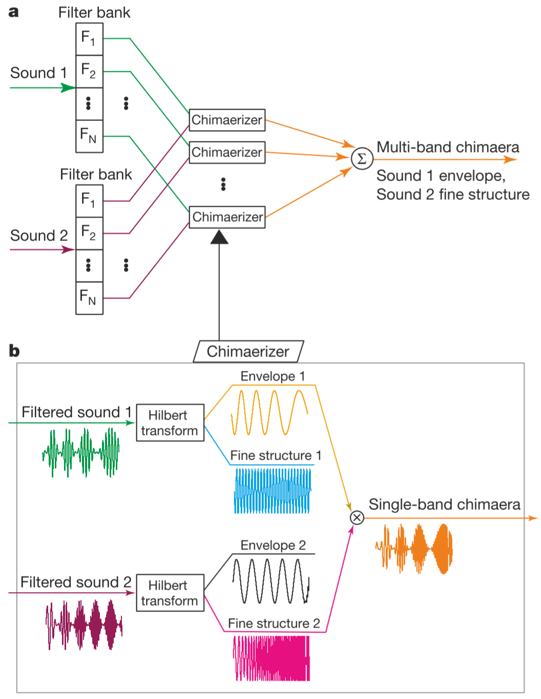
>
>The figure exhibits how auditory chimaera synthesis is done clearly.

This indicates that we should focus on the envelope extracted to improve the distinguishability of the synthesized speech signal, and focus on the fine structure for better pitch and tone performance.

<!-- 来自“确定有用的参考论文” -->

[^Smith]: Smith, Z. M., Delgutte, B., & Oxenham, A. J. (2002). Chimaeric sounds reveal dichotomies in auditory perception. *Nature*, 416(6876), 87–90.

The research done by Shannon et al.[^Shannon] provides a conciser instruction for our project.

>"The identification of consonants, vowels, and words in simple sentences improved markedly as the number of bands increased"

The feasibility of recognizing speech signal with "greatly reduced spectral information" is well proved.

<!-- 来自“参考论文” -->

[^Shannon]: Vongphoe, M., & Zeng, F. G. (2005). Speaker recognition with temporal cues in acoustic and electric hearing. *The Journal of the Acoustical Society of America*, 118(2), 1055–1061.

### Practice

A research by MacCallum et al.[^MacCallum] provides us with the instructions for setting the cutoff frequency of the low-pass filter.

>"To ensure accuracy in acoustic voice analysis, setting the cutoff frequency of a low-pass filter at least one octave above the fundamental frequency (minimum of $300\mathrm{Hz}$) is recommended."

[^MacCallum]: Julia K. MacCallum, Aleksandra E. Olszewski, Yu Zhang, Jack J. Jiang,Effects of Low-Pass Filtering on Acoustic Analysis of Voice, *Journal of Voice*, Volume 25, Issue 1, 2011, Pages 15-20.

The experimental results presented by Drullman, Festen and Plomp[^Drullman] took one step further in the discussion of the relationship between the sentence intelligibility number of bands and cutoff frequency chosen.

>"Amplitude fluctuations in successive $1/4$-, $1/2$-, or $1$-oct frequency bands can be limited to about $16\mathrm{Hz}$ without substantial reduction of speech intelligibility for normal-hearing listeners."
>
>"Listeners can only partially understand speech in quiet when the amplitude fluctuations are limited to $2\mathrm{Hz}$; performance improves as broader frequency bands are used"
>
>...

<!-- 来自“随意的没看过的高引用参考” -->

[^Drullman]: Drullman, R., Festen, J. M., & Plomp, R. (1994). Effect of temporal envelope smearing on speech reception. *The Journal of the Acoustical Society of America*, 95(2), 1053–1064.

---

## Code Implementation

To realize the function required in this project, we first wrote a function that is suitable for calculating the passband of each channel. The script is shown in the code block below.

```matlab
function [low, high] = passband(N, index)
    % passband - to get the pass band for each segment of frequency
    %
    % input -
    %   N - the number of channels
    %   index - the index of the frequency interval
    %
    % output -
    %   low - the lower cutoff frequency of the passband
    %   high - the higher cutoff frequency of the passband

    d200 = log10(200/165.4 + 1) / 0.06;
    d7000 = log10(7000/165.4 + 1) / 0.06;
    delta = d7000 - d200;
    dlow = d200 + (index - 1) / N * delta;
    dhigh = d200 + index * delta / N;
    low = 165.4 * (10^(0.06 * dlow) - 1);
    high = 165.4 * (10^(0.06 * dhigh) - 1);
end
```

Using the passband obtained in the above function, we may do filtering to seperate the original speech signal into channels, then process accordingly.

A 4-th order Butterworth filter is used to seperate the original speech signal into several channels. Then, envelope is extracted, and used to modulate sine wave signal, to produce a synthesized speech signal.

The main script for implementing `tone_vocoder` function is shown in the code block below.

```matlab
function sig = tone_vocoder(x, Fs, N, Fc)
    % tone_vocoder - the main function
    %
    % input -
    %   x - the speech signal to be processed, a row vector
    %   Fs - the sampling frequency of the speech signal
    %   N - the number of channels
    %   Fc - the cutoff frequency of LPF
    %
    % output -
    %   sig - the sum of the envelope extracted from the speech signal

    x = x';
    sig = zeros(1, length(x));
    [LPF_b, LPF_a] = butter(4, Fc / (Fs / 2));

    for index = 1:N
        [low, high] = passband(N, index);
        [BPF_b, BPF_a] = butter(4, [low high] / (Fs / 2));
        y = filter(BPF_b, BPF_a, x);
        y = abs(y);
        env = filter(LPF_b, LPF_a, y);

        n = 1:length(y);
        dt = n / Fs;
        f = (low + high) / 2;
        sine_wave = sin(2 * pi * f * dt);
        s = sine_wave .* env;
        sig = sig + s;
    end

    sig = sig / norm(sig) * norm(x);
end
```

---

## Experiment Content

### Task 1

After loading the voice signal, we plot the original signal with time in the first figure. There are obviously 11 signal blocks on the plot which corresponds to the 11 words the woman said. First, we pack the whole resynthesis process into one method called vocoder:

```matlab
function [sync] = vocoder(LPF, N, sig, fs)
    % N:the number we divide the frequency
    % LPF:cutoff frequency when extract envelope
    % sig:the signal to be operated
    % fs:the sampling rate
    sync = [zeros(1, length(sig))]';
    [LPF_b, LPF_a] = butter(4, LPF / (fs / 2));

    for i = 1:N
        [l, h] = getFreq(N, i);
        [BP_b, BP_a] = butter(4, [l, h] / (fs / 2));
        y = abs(filter(BP_b, BP_a, sig));
        enve = filter(LPF_b, LPF_a, y);
        n = 1:length(y); dt = n / fs;
        f1 = (l + h) / 2;
        sin1 = sin(2 * pi * f1 * dt)';
        %enve = enve / norm(enve) * norm(sig);
        sync = sync + enve .* sin1;
    end

    sync = sync / norm(sync) * norm(sig);
end
```

Then we use circulation to generate the signal after different resynthesis and their power spectrum density.
In task 1, we set LPF to be 50Hz and vary the number of divided bands.

The figures below are the comparison of audio waves of synthesized sentence and their PSDs (unit: dB) with different numbers of bands $N=1,2,4,6,8$ and same cutting frequency $F=\mathrm{50Hz}$.

For different generated sentences, we forecasted the sentences to 5 volunteers to find the intelligibility of different numbers of bands. The result is they can not figure out what the sentences exactly were saying for all the signals. But they can figure out the similar voice’s characters at $N=6$ and $N=8$ such as numbers of words, the up-down tone of voices and so on.

Comparing the plots of the original signal and the synthesis signal, we can see that when N is growing bigger, the details of signals are shown more. This is because the variety of frequency of the components(sine-waves) is richer when N is growing.  

Comparing the PSD of them, we can tell the main frequency of synthesis signal is exactly corresponding to the frequency of the middle frequency of divided band.

And the number of pitch is equal to the number of bands. Whatever, since the filters here are all not ideal, then other frequency still exists.

The plot for the speech signals are shown below.

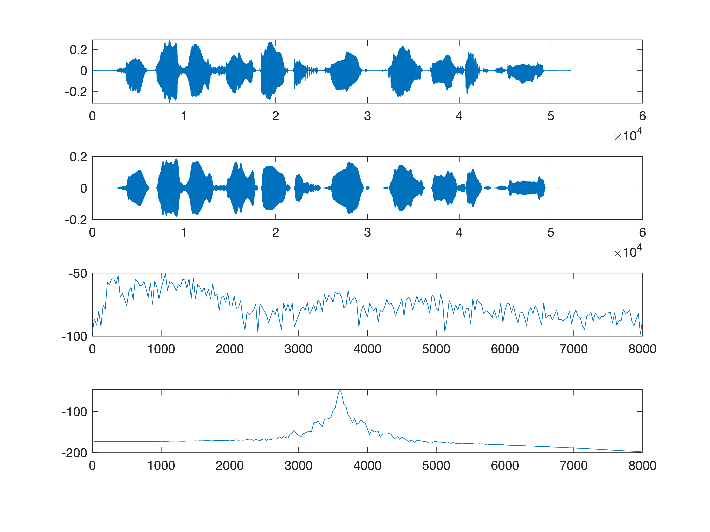

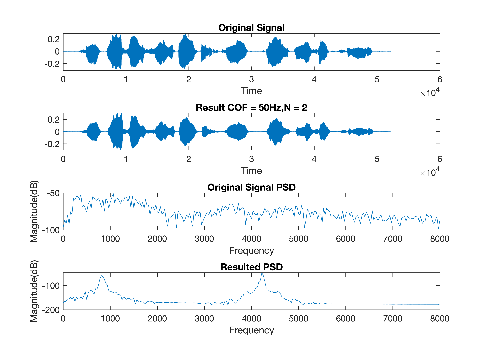


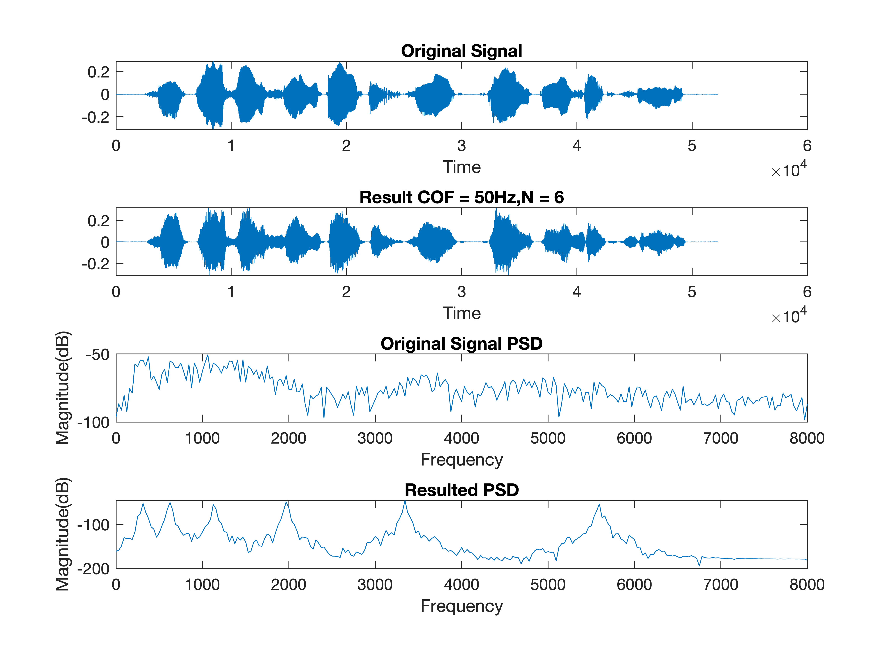

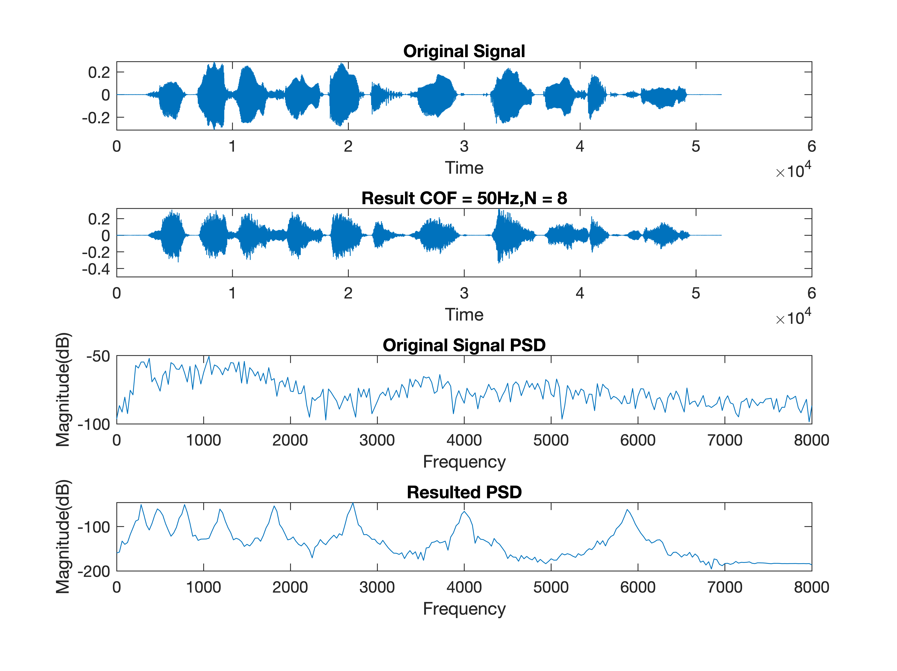

---

### Task 2

In this task, instead of changing the number of bands, we try to figure out the effect of cut-off frequency towards the speech signal. The plots show the figure of speech signal pass through low pass filters with cut-0ff frequency as 20Hz, 50 Hz, 100 Hz and 200 Hz.

The plots are shown below.


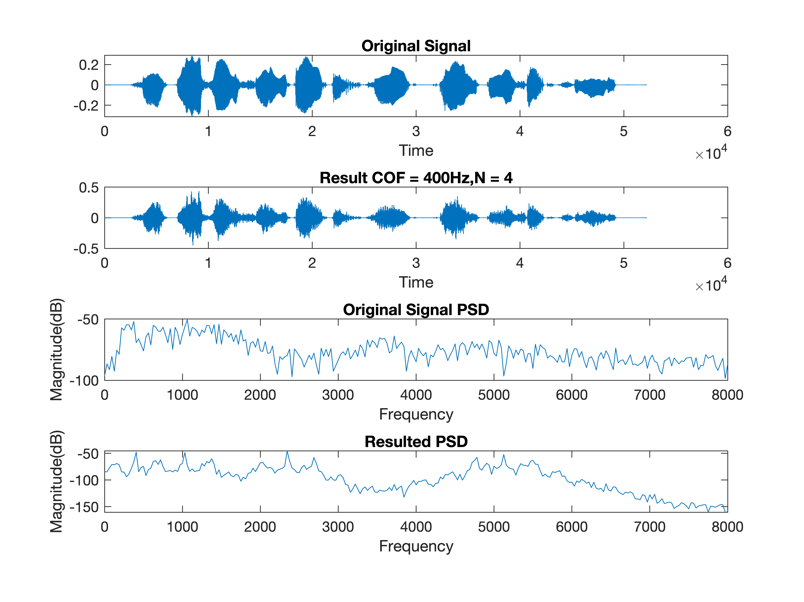

From the plots, we can easily see that the power spectrum intensity of the speech signal after processing have four peak, since it is matched with four sine signals in different frequency range. With the increase in cut-off frequency, the intensity is getting higher, this is because with higher cut-off frequency for a low pass filter, the more high frequency area it can pass, thus more details are shown.

After hearing the resulting signal, we can make a further conclusion that the higher the cutoff frequency, the easier for listener to understand the meaning of the speech signal.

To test our result, we invited five volunteers to hear the four resulting signals,we find that only when $N = 400$ that the listeners can understand the meaning.

---

### Task 3

After loading the voice signal, we plot the original signal with time in the first figure. There are obviously 11 signal blocks on the plot which corresponds to the 11 words the woman said. First, we pack the whole resynthesis process into one method called vocoder:

```matlab
function [sync] = vocoder(LPF, N, sig, fs)
    % N:the number we divide the frequency
    % LPF:cutoff frequency when extract envelope
    % sig:the signal to be operated
    % fs:the sampling rate
    sync = [zeros(1, length(sig))]';
    [LPF_b, LPF_a] = butter(4, LPF / (fs / 2));

    for i = 1:N
        [l, h] = getFreq(N, i);
        [BP_b, BP_a] = butter(4, [l, h] / (fs / 2));
        y = abs(filter(BP_b, BP_a, sig));
        enve = filter(LPF_b, LPF_a, y);
        n = 1:length(y); 
        dt = n / fs; 
        f1 = (l + h) / 2;
        sin1 = sin(2 * pi * f1 * dt)';
        % enve  =enve / norm(enve) * norm(sig);
        sync = sync + enve .* sin1;
    end

    sync = sync / norm(sync) * norm(sig);
end
```

Then we use circulation to generate the signal after different resynthesis and their power spectrum density.
In task 1, we set LPF to be 50 Hz and vary the number of divided bands.

The figures below are the comparison of audio waves of synthesized sentence and their PSDs (unit: dB) with different numbers of bands $N\mathrm{=1,2,4,6,8}$ and same cutting frequency $F\mathrm{=50Hz}$.

For different generated sentences, we forecasted the sentences to 5 volunteers to find the intelligibility of different numbers of bands. The result is they can not figure out what the sentences exactly were saying for all the signals. But they can figure out the similar voice’s characters at N=6 and N=8 such as numbers of words, the up-down tone of voices and so on.


Comparing the plots of the original signal and the synthesis signal, we can see that when N is growing bigger, the details of signals are shown more. This is because the variety of frequency of the components(sine-waves) is richer when N is growing.  

Comparing the PSD of them, we can tell the main frequency of synthesis signal is exactly corresponding to the frequency of the middle frequency of divided band.

And the number of pitch is equal to the number of bands. Whatever, since the filters here are all not ideal, then other frequency still exists.

---

### Task 4

In this task, base on task 2, we add white noise into the resulting signals.The plot for PSD still have four peak, since we cut it into four signals, processing them and add them up. And with higher cutoff frequency, the intensity is higher in general.

The plots are shown below.


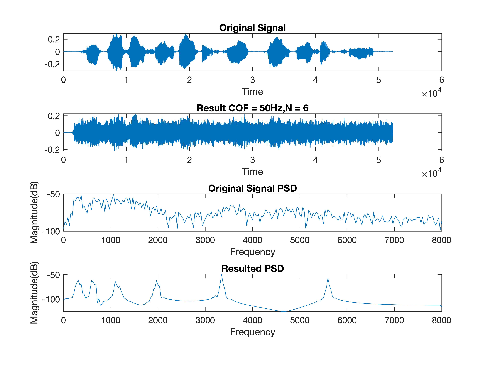


However, after adding white noise, we can also find out that for the PSD plot, intensity in frequencies away from peaks get higher in general. We think it is because the white noise have an even energy in all frequencies, so the total energy in all frequencies will be higher after adding white noise.

After hearing the signals, we find that for the first three results, which is when $\mathrm{COF = 20Hz, 50Hz , 100Hz}$. The voice seems to be covered totally by white noise, the only result we enable to hear the content is the one that with cutoff frequency 400Hz.

---

## Discussion

After we finish the four basic tasks, we can get a semiquantitative result, that is: with N getting larger and COF getting higher, the easier the resulted signal can be recognized. In the analysis for speech signals without white noise, we focus on PSD and find that when N is certain and COF increases, the recognition for speech signals nearly doesn't change. Therefore, we assume that the contribution of COF is few. In addition, we find that comparing the result for N is relatively small and COF is relatively high, and N is relatively large and COF is relatively low, though the PSD is with a big difference, but the level of recognition for the two signals are similar. As a result, we assume that for $COF\times N = C$ where $C$ is a constant, we can ensure that the recognition will be in a high degree despite the specific value for the two parameters.

Then we use different values to verify our assumption. After our tests, we find the lower bound for $C$ is $C = 1200$.

For signals with white noise, we assume that they have a similar phenomenon. After testing, we find that when COF get higher, the noise will also get larger. Therefore, for signals with white noise, there will also be a lower bound, however, we cannot set COF to be too high. According to our analysis, SSN, the noise we use, have a similar energy distribution for original signal. As a result, when COF increase, we can not only synthesize more details but also more noise signals.

Base on this understanding, after testing we find that the lower bound for the signal with white noise is $C = 2800$.

We also assume the connection between the two lower bounds. Since the signals with noise we use have a signal to noise ratio(SNR) of $-5\mathrm{dB}$, we find that the ratio of two lower bounds are close to the ratio of energy for original signals in signals with noise.

The PSD plots are shown below.


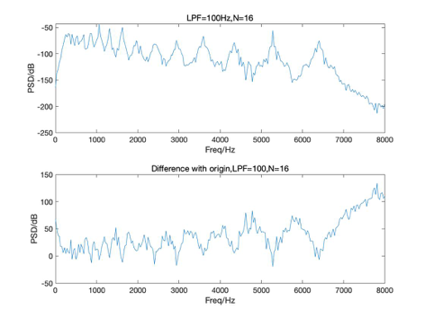


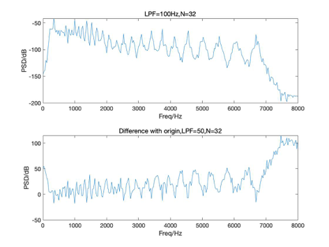

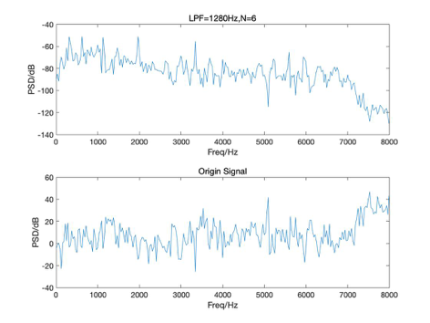

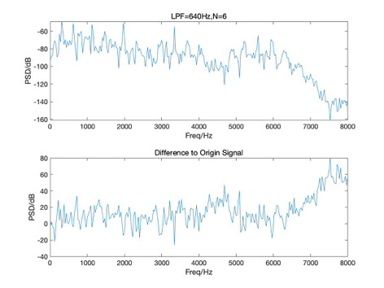

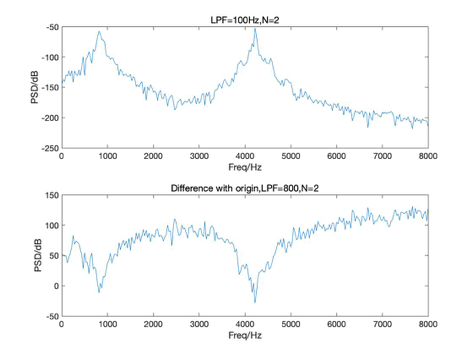

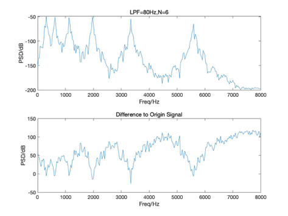

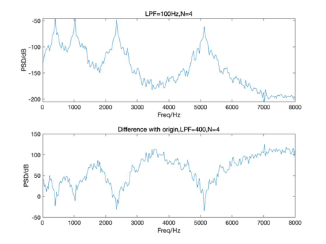

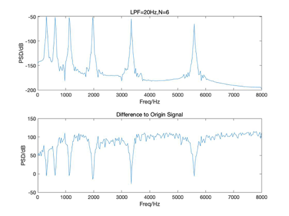

For the characteristic of spectrum, the synthesis signals which are more intelligibility‘s spectrum is more uniform, which is to say that the difference with original is close through the frequency domain. To be exact, the graph of difference should oscillate between local maximum and local minimum, and the rate should be high enough. Each local maximum should be close to each other, so as the local minimum.

---

## Appendix

### Contribution

Xue Feng: Task 1-4, code optimization(codes for function), project expansion，presentation for discussion and investigation part.

He Xinyi: Task1-4, reports for task 1,3 and background part, presentation for introduction part.

Gong Xinrui: Task 2,4, reports for task 1,3 ,discussion and introduction part, presentation for methodology part.

Huang Guanchao: Code optimization(codes for function)and corresponding reports,reports for feasibility and practice part, presentation for conclusion part.
