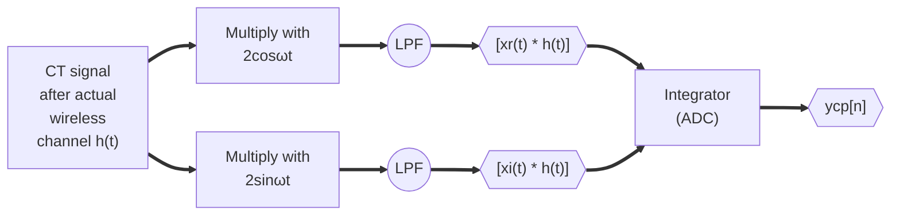
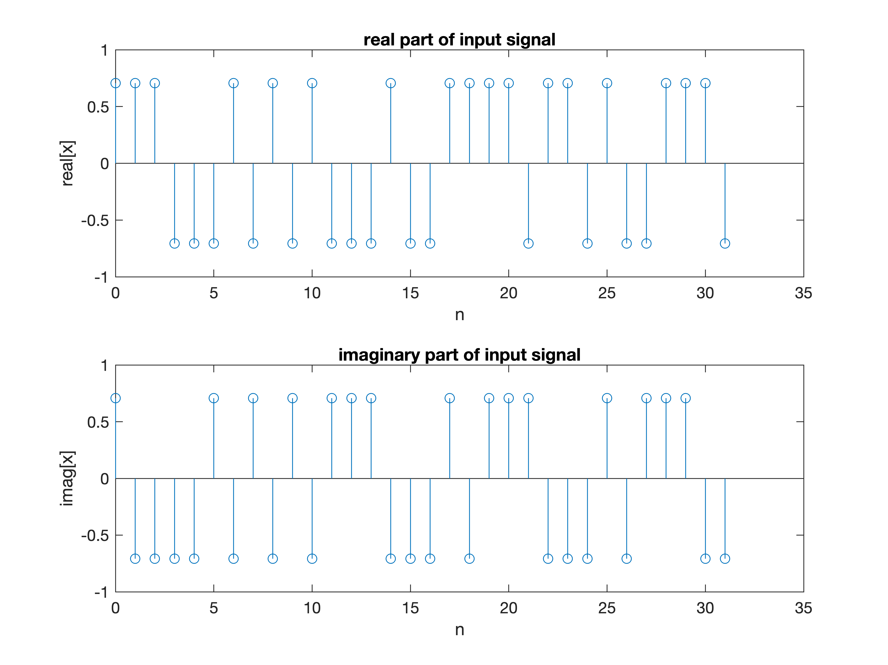
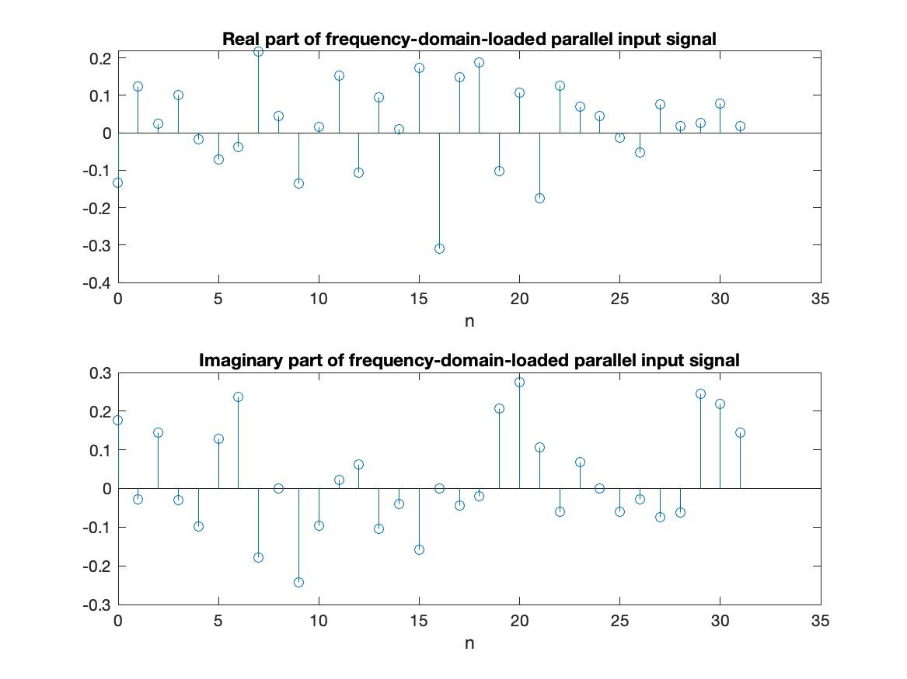
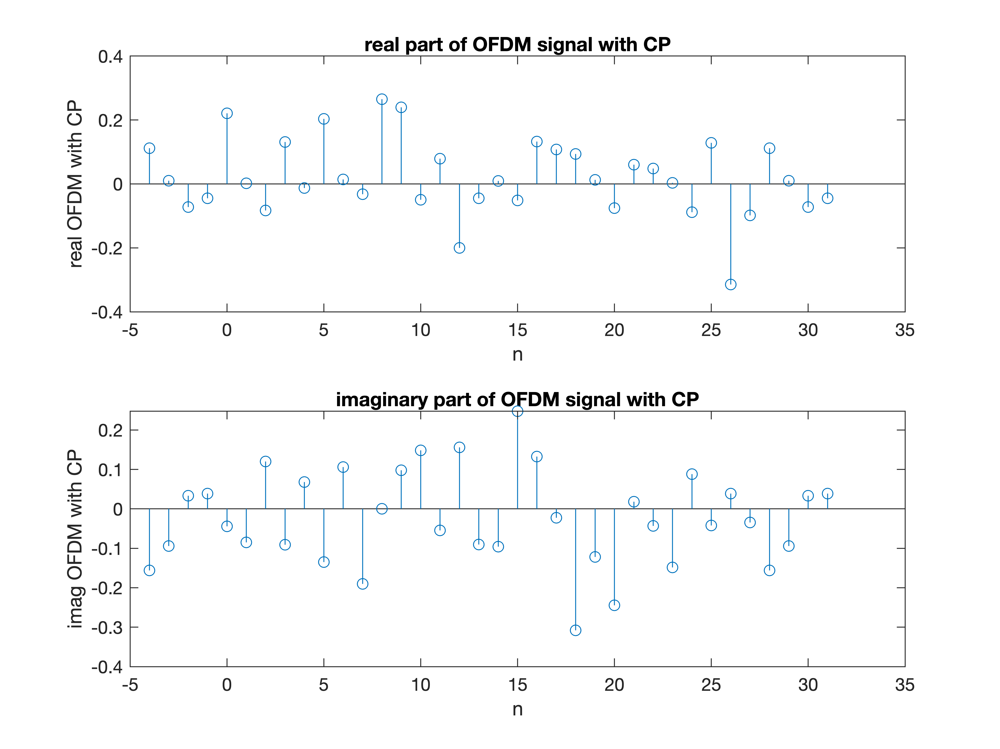
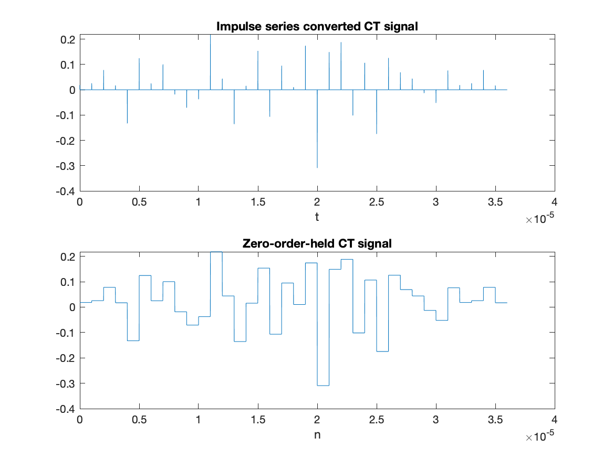
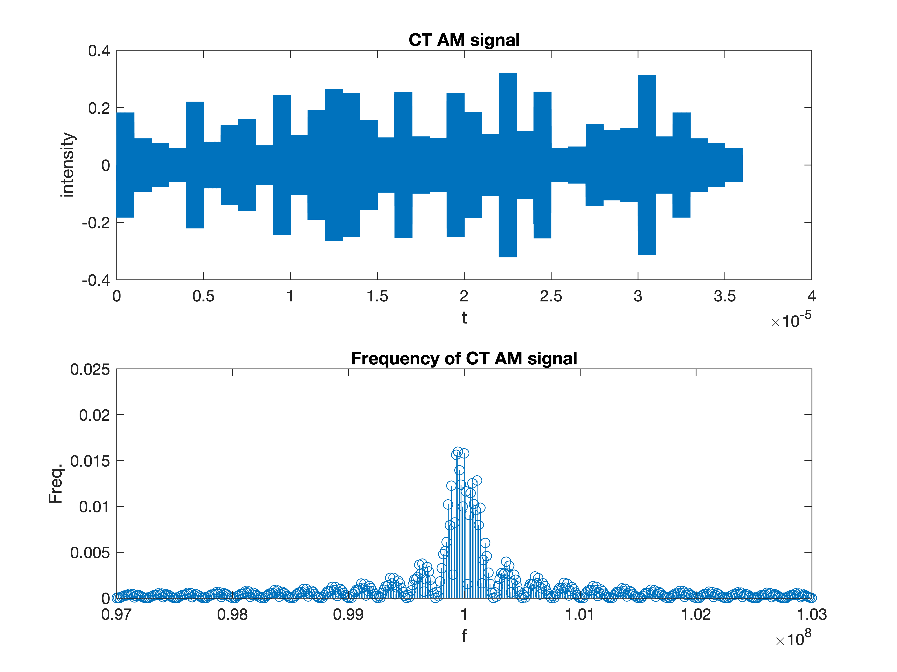
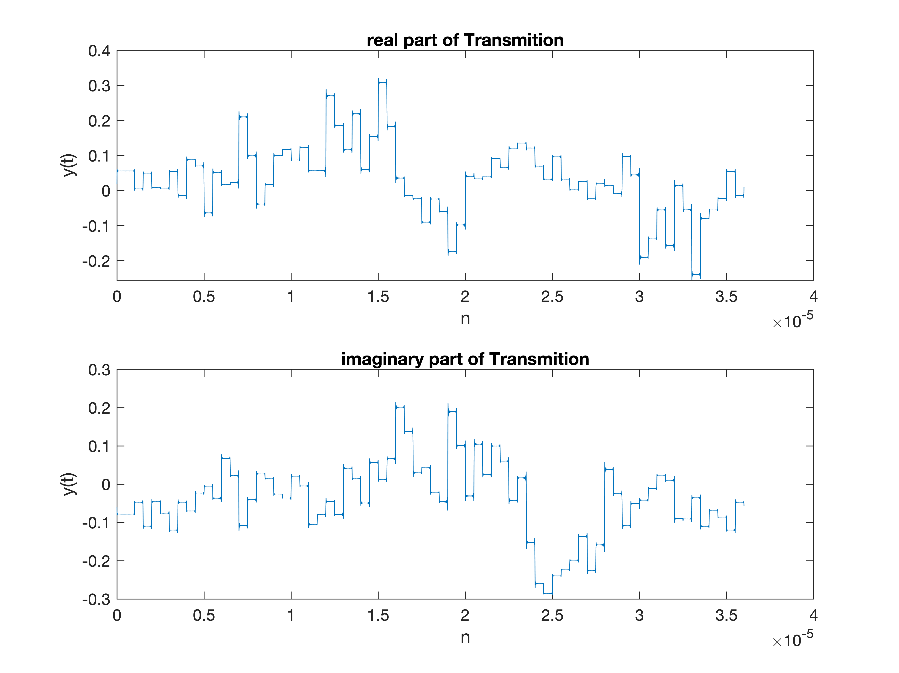
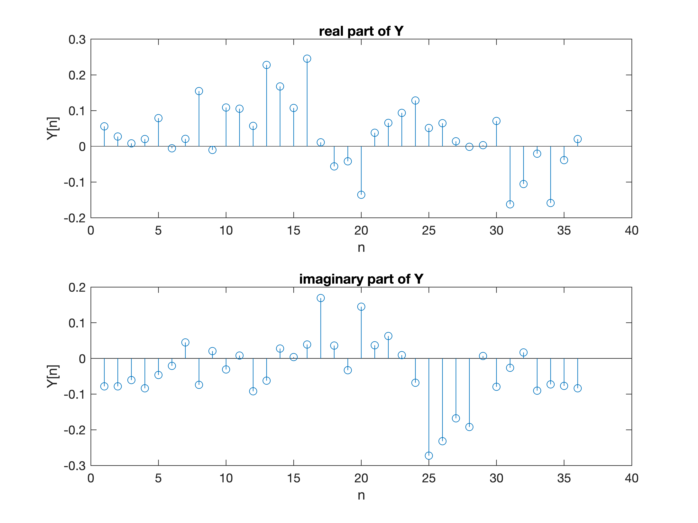
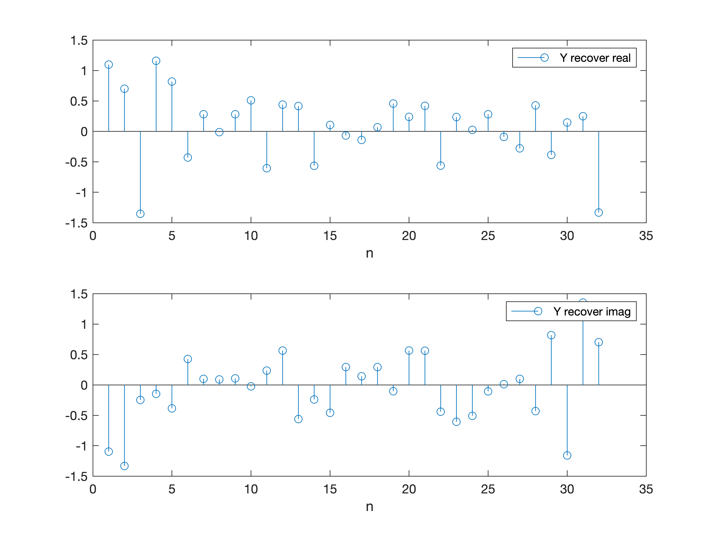
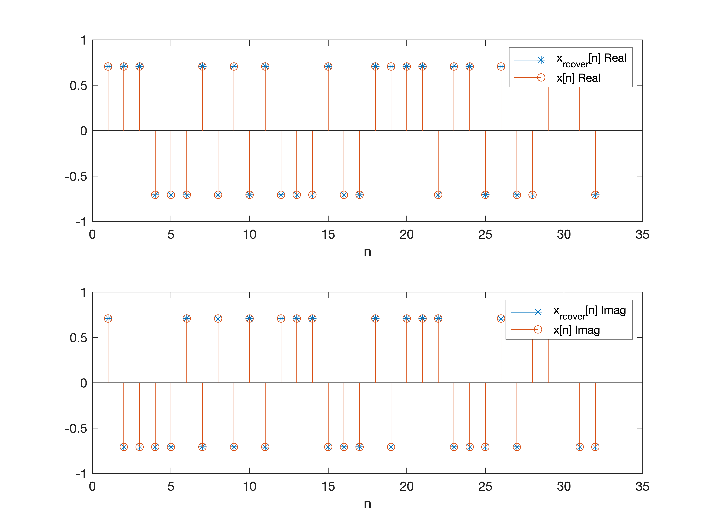

# Report of Signals and Systems Lab Project 2

The report for the first project of Signals and Systems lab session, written by following team members:

- HUANG Guanchao, SID 11912309 from SME
- GONG Xinrui, SID 11911233 from BME
- XUE Feng, SID 11913020 from MEE
- HE Xinyi, SID 11911234 from BME

The complete resources, including report in `.pdf` and `.md` format, as well as all MATLAB scripts, can be retrieved at [our GitHub repo](https://github.com/SamuelHuang2019/ss-project).

[toc]

---

## Abstract

In this project, we implemented the whole process of OFDM in signal transmission with MATLAB, including

- the generation of signal
- loading signal in frequency domain
- adding cyclic prefix
- transmission in the channel
- remove the cyclic prefix in receiver-side
- recover the original signal in time domain

## Introduction

In our practice, the baseband, or carrier signal we choses is a sine wave and a cosine wave signal. The sine wave is for the real part, and the cosine wave is for the imaginary part.

```matlab
% time-step
dt = 1e-9;
% carrier signal frequency
wc = 100e6;

t = (1:length(x_sq)) * dt;
sin1 = sin(2 * pi * wc * t);
cos1 = cos(2 * pi * wc * t);
```

The signals to be transferred are firstly loaded in the frequency domain with `ifft()` function.

```matlab
X = xr + 1i * xi;
x = ifft(X);
```

Then, a cyclic prefix is added to the signal loaded in the frequency domain to obtain OFDM features.

```matlab
x_cp = [x(N - lcp + 1:N), x];
```

After that, digital-analog-convert is done. Also, reshape the sampled impulse series into zero-order held square wave series.

```matlab
x_cp_ct = upsample(x_cp, 1000);
x_sq = reshape(repmat(x_cp, 1000, 1), 1, []);
```

In this process, the signal is upsampled by inserting $1000 - 1 = 999$ zeros between the samples of the DT signal.

Next, do amplitude modulation.

```matlab
t = (1:length(x_sq)) * dt;
sin1 = sin(2 * pi * wc * t);
cos1 = cos(2 * pi * wc * t);
x_am = cos1 .* real(x_sq) + sin1 .* imag(x_sq);
```

The transmission channel is defined as

```matlab
A = 1;
B = [0.5 zeros(1, 1.5e3 - 1) 0.4 zeros(1, 1e3 - 1) 0.35 zeros(1, 0.5e3 - 1) 0.3];
```

The signal is passed through which.

```matlab
yh = filter(B, A, x_am);
```

---

## Receiver Design and Analysis

### Receiver RF Front-End & ADC (Block 4)

The process diagram of the design of receiver RF front-end with ADC(Block 4) is shown below.



Firstly, we use coherent demodulation, to divide the real part and image part of the signal. Because we modulate the signal in block 3 by multiplying sine and cosine wave, we can demodulate it by doing this inversely. After multiplying with $2\sin\omega_ct$ and $2\cos\omega_ct$ separately, the analytical result is shown as below.

$$
\begin{cases}
2\cos\omega_ct[x_r(t)\cos\omega_ct + x_i(t)\sin\omega_ct]=
x_r(t) + x_r(t)\cos{2\omega}_ct + x_i(t)\sin{2\omega}_ct \\
2\sin\omega_ct[x_r(t)cos\omega_ct + x_i(t)\sin\omega_ct] =
x_i(t) - x_i(t)\cos{2\omega}_ct + x_r(t)\sin{2\omega}_ct
\end{cases}
$$

We use LPF to get the real and imaginary part of $x(t)$ and add them together as $x_r(t) + x_i(t)i$ to get $y(t)$, which still contains the CP. Then we use integrator as ADC part to accumulate the received power and generate DT signal $y_\text{CP}[n]$.

$$
\begin{aligned}
y_\text{int}(t) & =
\frac{1}{T} \int_{t - T}^{t} y_{\text{dem}(\tau)}\mathop{d\tau} \\
y[n] & =
y_\text{int}(nT) =
\frac{1}{T} \int_{(n-1)T}^{nT} y_{\text{dem}(\tau)}\mathop{d\tau} =
\frac{1}{T} \int_{(n-1)T}^{nT}{x_c(\tau) h(\tau)}\mathop{d\tau}
\end{aligned}
$$

Finally, we need to remove the CP and get the result $y[n]$, which corresponds to the convolution of $x[n]$ and $h[n]$.

---

## Simulations

We first create a signal as follows:

```matlab
% set real and imaginary part of signal
xr = sqrt(2) * round(rand(1, N)) - sqrt(2) / 2; 
xi = sqrt(2) * round(rand(1, N)) - sqrt(2) / 2;
```

The plot for our signal is as below.



Then we use `ifft()` to produce the signal in time domain.  



After that we add `cp` with length of 4 to this signal.



To make our signal discrete, we first produce the impulse result of OFDM signal and then use square signal to simulate it.



Then we add carrier signal to the OFDM signal.



After that, we simulate the process of real wireless channel.


Then the signal experience a process of demodulation and pass through a LPF.



Sampling:



Then we remove cp.



Then we can recover X since `X_recover_N=Y_recover_N./H;`



---

## Discussions

---

### Applications

OFDM is now used in most new and emerging broadband wired and wireless communication systems because it is an effective solution to intersymbol interference caused by a dispersive channel. And now it will approximately be used in some other fields.

In spite of the widespread use of OFDM in wireless communication, recently OFDM has also applied in optical communication[^Armstrong]. OFDM used in optical communication has some difference with the traditional one, and the following table can clearly show the distinctions.

[^Armstrong]:J. Armstrong, "OFDM for Optical Communications," in Journal of Lightwave Technology, vol. 27, no. 3, pp. 189-204, Feb.1, 2009, doi: 10.1109/JLT.2008.2010061.


To let OFDM useful in optical communication systems, in the optical domain, optical receivers use square-law detectors for producing a $H_k$ close to be a constant or slowly varying. Other improvement like using Intensity Modulation, MIMO-OFDM are also widely use in optical communication systems.

In addition, based on OFDM, some waveforms having the same principles are created for 5G development[^Moradi]. WAveforms like Generalized frequency division multiplexing (GFDM) is introduced in 2009 by Fettweis et al. is an "improvement to OFDM in which filtering is imposed on each subcarrier band to minimize the overlapping among subcarriers, thus facilitate multiuser application without worrying about accurate synchronization of the users.",it also solves the downside of adjacent subcarriers suffer from some level of interference from adding cp to the signals.

[^Moradi]:B. Farhang-Boroujeny and H. Moradi, "OFDM Inspired Waveforms for 5G," in IEEE Communications Surveys & Tutorials, vol. 18, no. 4, pp. 2474-2492, Fourthquarter 2016, doi: 10.1109/COMST.2016.2565566.


Moreover, O-OFDM, a kind of improvement OFDM waveforms are a promising modulation[^Elgala] for Visible light communications (VLC) technology, which permits the exploitation of light-emitting diode (LED) luminaries for simultaneous illumination and broadband wireless communication.

[^Elgala]:. Hany Elgala and Thomas D. C. Little, "Reverse polarity optical-OFDM (RPO-OFDM): dimming compatible OFDM for gigabit VLC links," Opt. Express 21, 24288-24299 (2013)

---

### Advantages

1. Its ability to precisely tailor the transmitted signal to the frequency characteristics of the channel.[^Ballal]

2. It reduces ISI and IFI through use of a cyclic prefix and fading caused by multipath propagation.

3. Channel equalization becomes simpler than by using
adaptive equalization techniques with single carrier
systems.

4. It is less sensitive to sample timing offsets than single carrier systems are.

5. It is robust against narrow-band co-channel interference.

6. It is more sensitive to carrier frequency offset and drift than single carrier systems are due to leakage of the DFT.

7. OFDM is computationally capable by using FFT
techniques to implement the modulation and demodulation functions.

[^Ballal]:Beena R. Ballal, Ankit Chadha, Neha Satam, "Orthogonal Frequency Division Multiplexing and its Applications", International Journal of Science and Research (IJSR),  Volume 2 Issue 1, January 2013, 325 - 328

---

### Disadvantages

1. The OFDM signal has a noise like amplitude with a very large dynamic range; hence it requires RF power
amplifiers with a high peak to average power ratio.

2. It is more sensitive to carrier frequency offset and drift than single carrier systems are due to leakage of the DFT.

3. It is sensitive to Doppler shift.

4. It requires linear transmitter circuitry, which suffers from poor power efficiency.

5. It suffers loss of efficiency caused by cyclic prefix.

---

## Appendix
